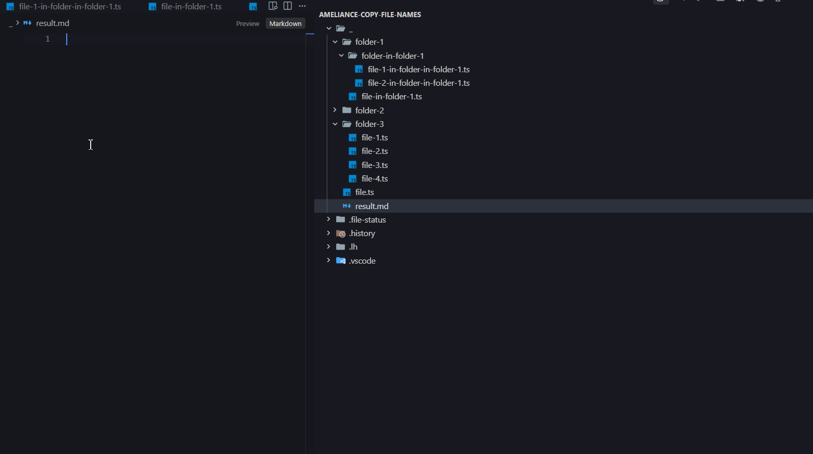
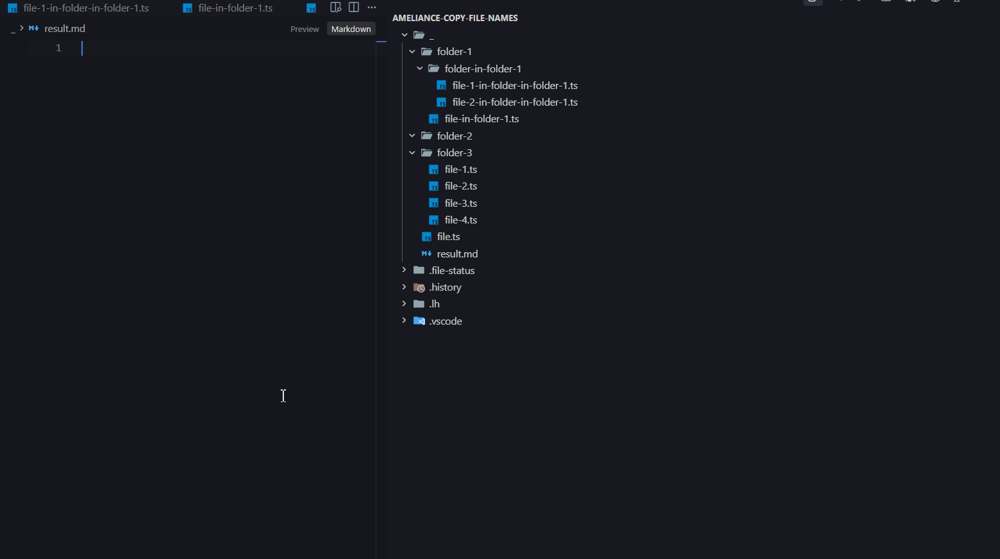
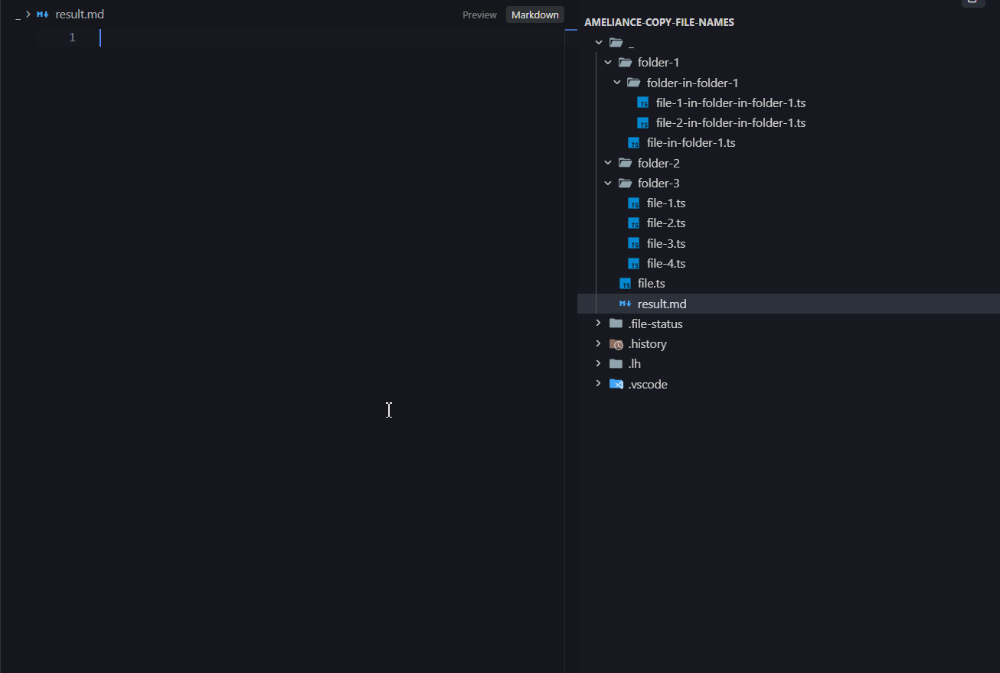
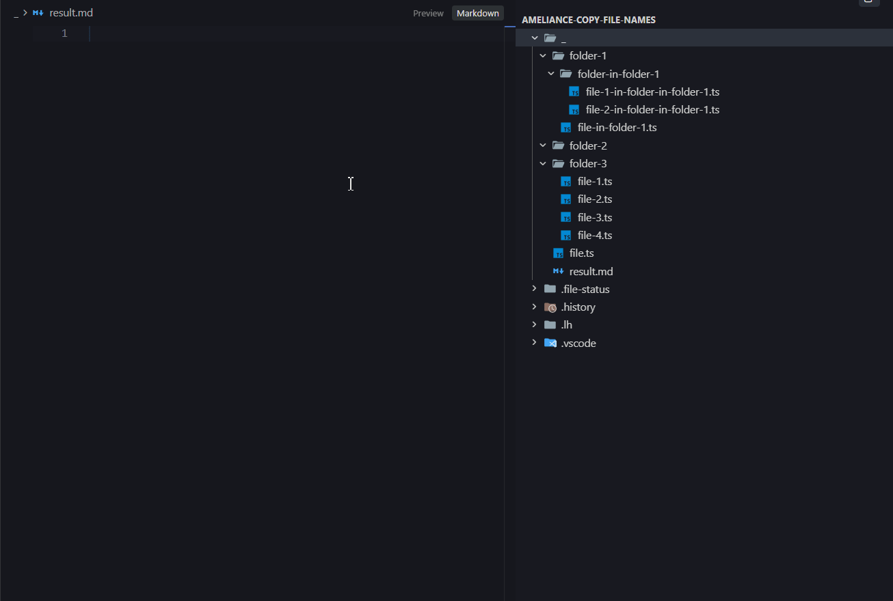
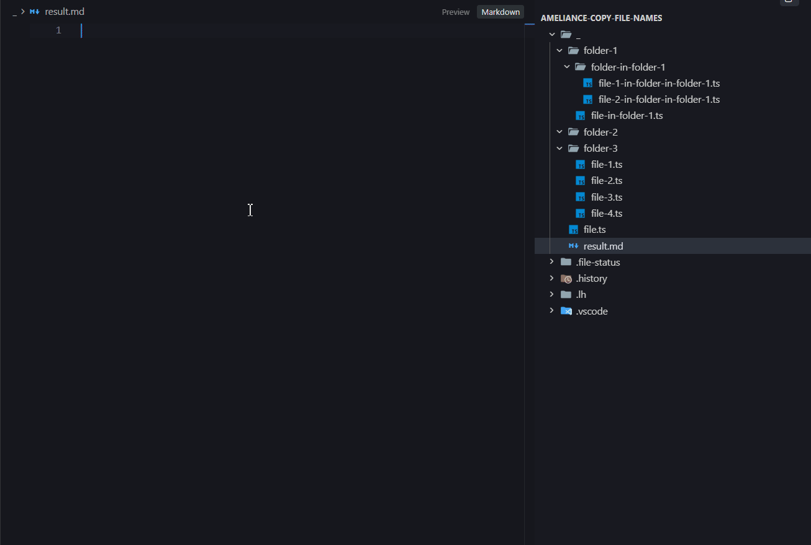

# Ameliance Copy File Names

A powerful and highly customizable VS Code extension that allows you to effortlessly copy file names, folder structures, and generate beautiful ASCII directory trees directly from the Explorer context menu.

Whether you need a quick list of files for documentation, or a fully formatted ASCII tree for your project's README, this extension has you covered.

## Features

Access all features easily by right-clicking any file or folder in the VS Code Explorer and navigating to the Copy Special... menu.

- Copy: Names
- Copy: File Names In Folder (Recursive)
- Copy: File Names In Folder (Flat)
- Copy: Names In Folder With Folders (Recursive)
- Copy: Names In Folder With Folders (Flat)
- Copy: ASCII Tree (Recursive)
- Copy: ASCII Tree (Selected)

### Copy: Names

Quickly copies the exact names of the selected files or folders.



### Copy: File Names In Folder (Recursive)

Deeply scans the selected folder and copies a flat list of all file names inside it, including those in subfolders (ignores folder names).


### Copy: File Names In Folder (Flat)

Copies only the file names located directly inside the selected folder (ignores subfolders entirely).


### Copy: Names In Folder With Folders (Recursive)

Scans the selected directory and copies both folder and file names recursively, maintaining a clean, structured list grouped by directories.


### Copy: Names In Folder With Folders (Flat)

Copies both folder and file names located directly inside the selected folder (Folders are sorted to appear at the top).


### Copy: ASCII Tree (Recursive)

Generates a complete, beautifully formatted ASCII tree representation of the selected folder and all its nested contents. Perfect for project documentation!



### Copy: ASCII Tree (Selected)

Generates an ASCII tree using only the explicitly selected files and folders in the Explorer. Great for showing a partial or specific project structure.


## Settings / Configuration

This extension is highly customizable! You can configure exactly how folder symbols and ASCII tree elements are drawn. Go to `Settings` -> `Extensions` -> `Copy File Names` to adjust these options:



### File Names

- `amelianceCopyFileNames.names.folderEndSymbol`: Symbol added at the end of folder names in standard Name lists. _(Default: empty)_

### Names With Folders

- `amelianceCopyFileNames.namesWithFolders.folderEndSymbol`: Symbol added at the end of folder names when copying mixed lists of files and folders. _(Default: `/`)_

### ASCII Tree

Customize the entire look of your ASCII generated trees:

- `amelianceCopyFileNames.ascii.folderEndSymbol`: Symbol appended to folder names in the tree. _(Default: `/`)_
- `amelianceCopyFileNames.ascii.verticalLine`: The vertical line symbol used for deep branches. _(Default: `│   `)_
- `amelianceCopyFileNames.ascii.item`: The branching symbol for a regular item. _(Default: `├── `)_
- `amelianceCopyFileNames.ascii.lastItem`: The corner symbol for the last item in a directory. _(Default: `└── `)_
- `amelianceCopyFileNames.ascii.indent`: The empty space indentation used under the last item of a folder. _(Default: `    ` - 4 spaces)_

## Release Notes

```
0.0.1 [2026_03_19]:
	+ Initial release of the Ameliance Copy File Names extension
	+ Added 7 powerful copying commands (Flat, Recursive, and ASCII Trees)
	+ Added full customization for folder symbols and ASCII tree formatting
	+ Smart "Folders-First" sorting implemented across all commands
```

---

## ❤️ Support

If you find this extension helpful, consider buying me a coffee to support future updates!

[](https://www.buymeacoffee.com/ameliance)
